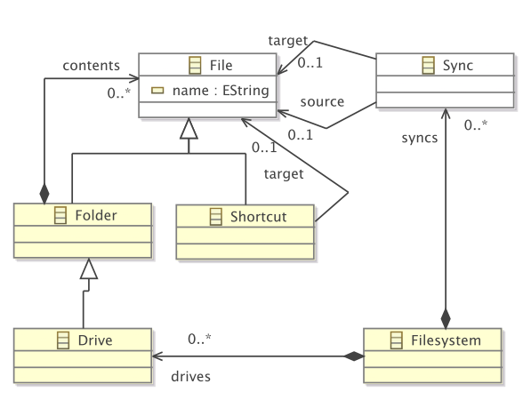
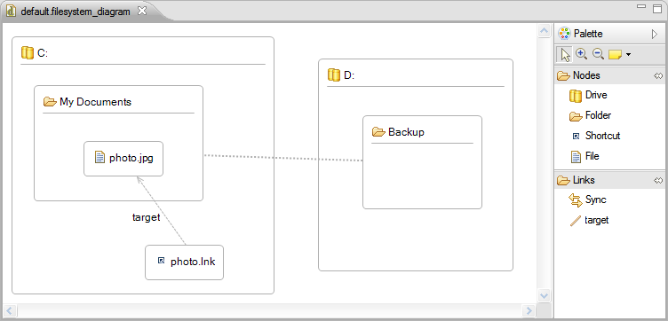

# Metamodelling with the EMF

## Tutorial

* Read sections 1 to 6 from this [article](http://www.vogella.com/articles/EclipseEMF/article.html).
* Follow the instructions in the tutorial in order to create an Ecore model and an instance of it.

## Activities

1. Define the class diagram below using EMF:

2. Generate the corresponding editor plugin or follow the steps in section [Working with models without generating code](#working-with-models-without-generating-code) to work without generating code.

3. Define the abstract syntax of the diagram given in the figure below [source](http://www.eclipse.org/epsilon/doc/articles/eugenia-gmf-tutorial/Filesystemscreenshot2.png) by using the editor that has been generated.

## Working with models without generating code

We will use some facilities provided by the [Eclipse platform](https://www.eclipse.org/epsilon/) for this. To open a model that conforms to an Ecore metamodel using reflection (that is, without generating code) do as follows:

* Register the Ecore metamodel:
  * right-click on the Ecore metamodel, e.g. `model/filesystem.ecore`
  * select `Register EPackages`
* Open the model:
  * Create a sample model:
    * Open the Ecore metamodel `model/filesystem.ecore`;
    * Right-click on the root EClass `Filesystem`;
    * `Create dynamic instance...` and give a name to your model, e.g. `Filesystem.xmi`.
  * Right click on the generated model file and select `Open with Sample Reflective Ecore Editor`. That's what you would get if you generate the editor code.

## Additional resources

* The [Eclipse Modelling Framework Project](http://www.eclipse.org/modeling/emf/)(1/10/2012)
* [Documentation page for the Eclipse Modelling Framework](http://www.eclipse.org/modeling/emf/docs/) (1/10/2012)
* Dave Steinberg, Frank Budinsky, Marcelo Paternostro, Ed Merks (2008) EMF: Eclipse Modeling Framework. Addison-Wesley Professional. 2nd edition.

